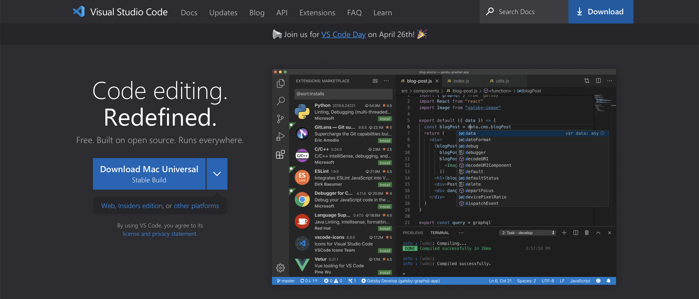
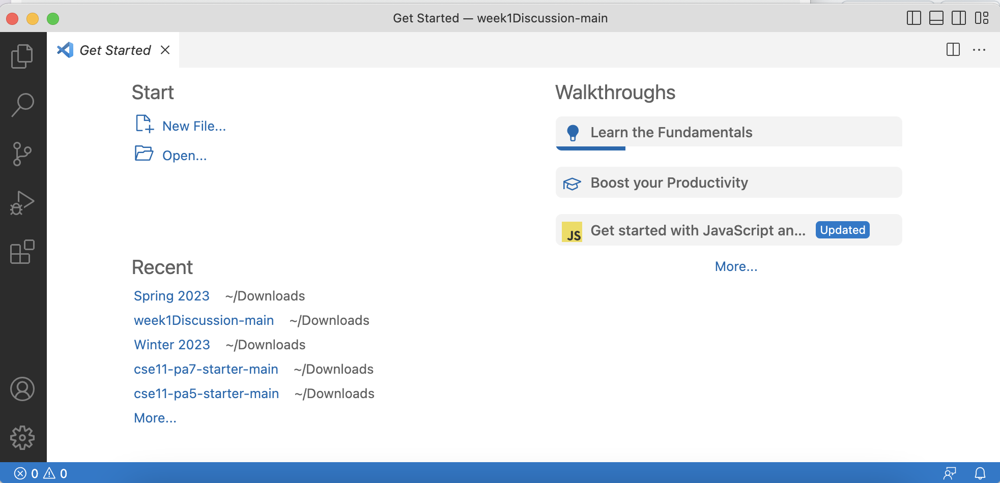
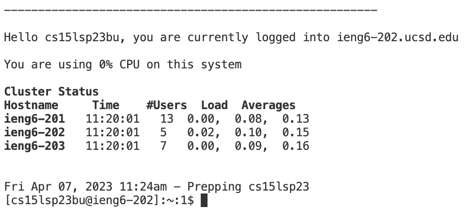
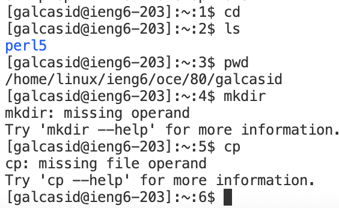

# Installing VScode
* The first step to using Java on your computer and remotely connecting for this class is to download VScode. For me, I already have this downloaded, but for those who haven't, you will want to visit [https://code.visualstudio.com/](https://code.visualstudio.com/) and download the correct version depending on the operating system you're using.

* After downloading, opening up the application, and picking the display of your choice, it should take you to a page that looks like this. Mine is bright because I chose the light mode, but many tend to go for the dark mode. Either way, seeing this page means that you have successfully installed VScode, and can now move onto the next step. 


# Remotely Connecting
* Open a new terminal on VScode (if mac user: it's located at the top of the screen - same row as apple logo)
* type in
```
ssh cs15lsp23bu@ieng6.ucsd.edu
```
and press return (replace cs15lsp23bu with your own username) (windows users will need to install git for windows before this step)
* When you see (yes/no/[fingerprint])?, type yes and return


# Trying Some Commands
* You can try typing in: cd, ls, pwd
* log out of the remote server by ctrl d

