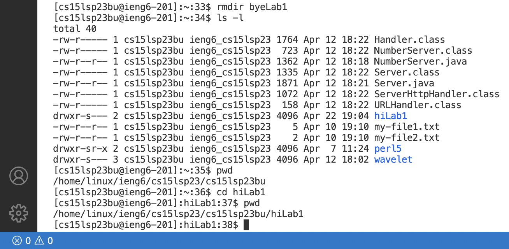

# Installing VScode
* The first step to using Java on your computer and remotely connecting for this class is to download VScode. For me, I already have this downloaded, but for those who haven't, you will want to visit [https://code.visualstudio.com/](https://code.visualstudio.com/) and download the correct version depending on the operating system you're using.

* After downloading, opening up the application, and picking the display of your choice, it should take you to a page that looks like this. Mine is bright because I chose the light mode, but many tend to go for the dark mode. Either way, seeing this page means that you have successfully installed VScode, and can now move onto the next step. 


# Remotely Connecting
* Trying to remotely connect for the first time was, in my experience, a very lengthy and tiring process that required a lot of patience. Know that following through step by step can still lead to some errors, and that it's ok because it happens to all of us! Just remember to have patience and ask for help if you need it. 

* Once you do this, a terminal should pop up at the bottom of the screen. In the terminal, type in:
```
ssh cs15lsp23bu@ieng6.ucsd.edu
```
* and press return (but be sure to replace cs15lsp23bu with your own username!)
* For Windows users, before this step, you will need to install git for windows which can be found here: [https://gitforwindows.org/](https://gitforwindows.org/) 
* After pressing enter, you will see a lot of text, but look for where it says (yes/no/[fingerprint])?. If you see this, just like when typing your username into the terminal earlier, you'll want to type in:
```
yes
```
* and then again pressing return.
* Once you see your terminal output the screenshot below (but with your username), you have successfully remotely connected!


# Trying Some Commands
* So you've successfully opened a terminal and remotely connected, so now it's time to explore and learn some commands!
* You can start by typing these in:
```
pwd
```
```
ls
```
* which will give you these outputs:

* pwd stands for print working directory. As the name suggests, this command prints out the current directory that you're in. 
* Now what about ls? ls is short for list, and typing this command will output a pile of files and folders like in the picture above. 
* Now type in:
```
ls -l
```
* This is like the ls command but gives more information. 
* More commands you can try are:
```
mkdir hiLab1
```
```
mkdir byeLab1
```
```
rmdir byeLab1
```
* mkdir stands for make directory, and rmdir stands for remove directory. If you typed all of these in and did the ls -l command, you will see the directory you made and did not remove:


* In the screenshot above, after typing in ls -l, I then type in pwd again and this new command called cd along with the name of the directory that I made. cd stands for change directory. As you can see from the picture, the path that showed when I did pwd the first time is different from when I did it the second time after changing directories.
* Lastly, to close out of the remote server, use ctrl d:

