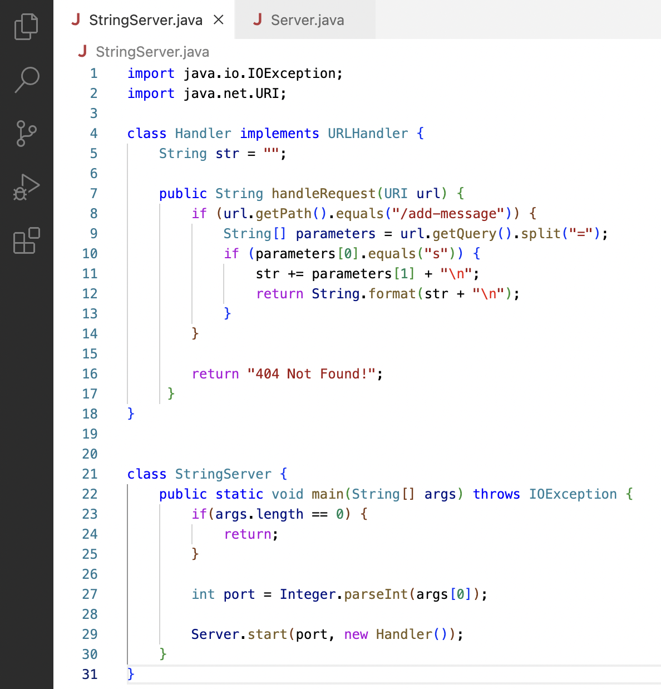
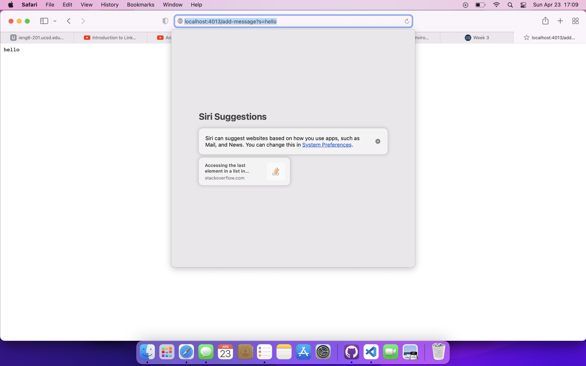
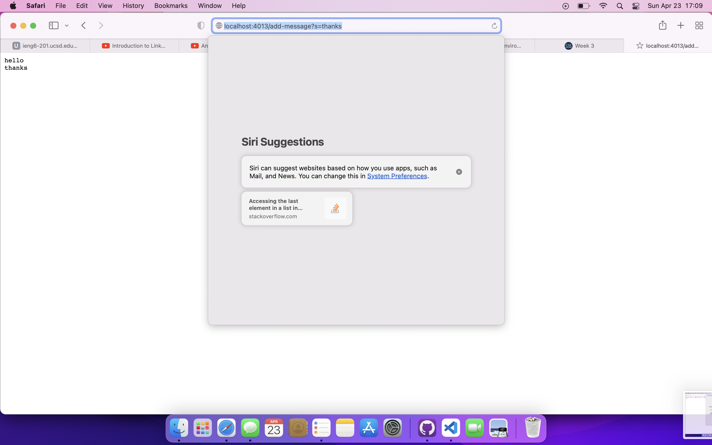
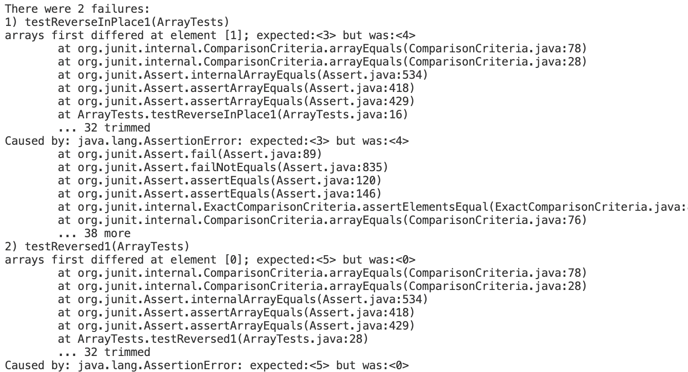

# Part 1
* Here is a screenshot of my code for StringServer:

* And below are two screenshots using /add-message twice:

* In the image above, I am calling /add-message for the first time.
* The handleRequest method is called. When this is called, the String value str at first equals "", and the argument being passed is /add-message?s=hello
* Because /add-message is conatined in the url, "hello" and a line break are added into str, and the message "hello" is printed on the site.

* In the image above, I am calling /add-message for the second time.
* The handleRequest method is called. When this is called, str equals "hello" + "\n", and the argument being passed is /add-message?s=thanks
* Because /add-message is contained in the url, "thanks" and a line break are added into str, and the message "thanks" is printed on the site below the first message.

# Part 2
* Here is code for a method that attempts to reverse the order of items in an array:
```
public class ArrayExamples {
  // Changes the input array to be in reversed order
  static void reverseInPlace(int[] arr) {
    for(int i = 0; i < arr.length; i += 1) {
      arr[i] = arr[arr.length - i - 1];
    }
  }
}
```
* This is the JUnit test using a failure-inducing input:
```
public class ArrayTests {
  @Test 
	public void testReverseInPlace1() {
    int[] input2 = { 3, 4 };
    ArrayExamples.reverseInPlace(input2);
    assertArrayEquals(new int[]{ 4, 3 }, input2);
	}
}
```
* This is the JUnit test using an input that doesn't induce a failure:
```
public class ArrayTests {
	@Test 
	public void testReverseInPlace() {
    int[] input1 = { 3 };
    ArrayExamples.reverseInPlace(input1);
    assertArrayEquals(new int[]{ 3 }, input1);
	}
}
```
* When you run these two tests, the following symptom is shows:

* Note: this image is the result of running 4 tests, causing 1 of the 2 failures, but for the sake of focusing on one bug, this post is omitting these additional tests.
* So why is one of the tests showing an error and that other one isn't?
