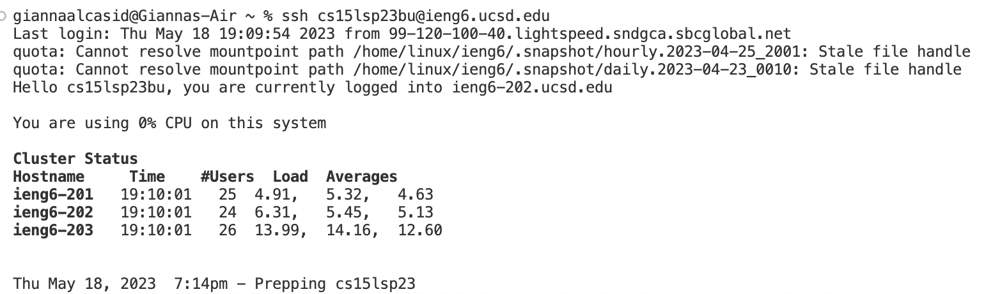
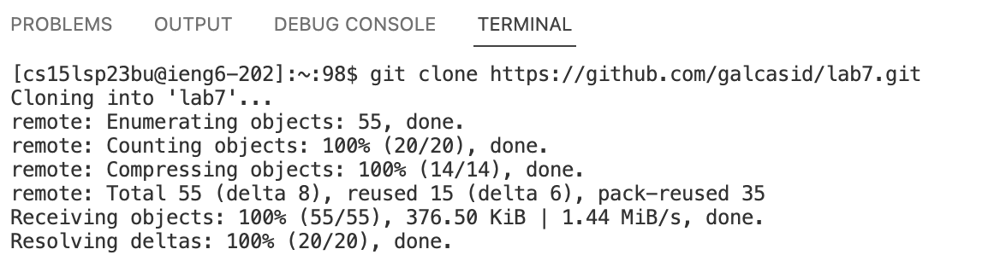
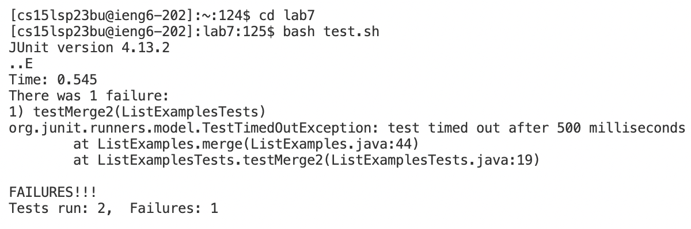
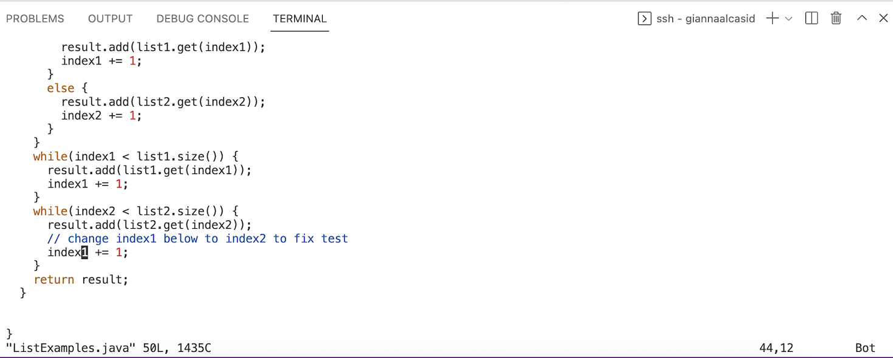
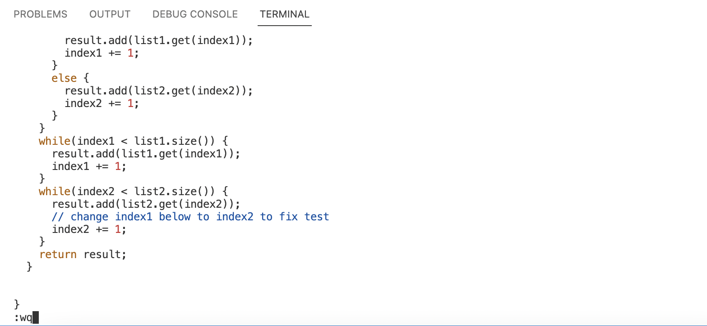
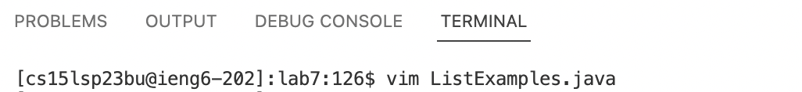
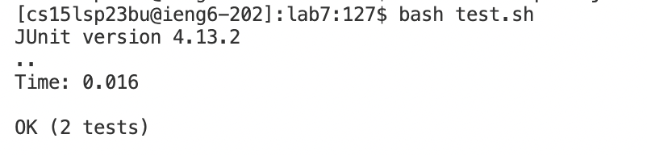

# Lab Report 4
### Step 4: Log into ieng6

* keys pressed: ```ssh<space>cs15lsp23bu<shift>2ieng6.ucsd.edu<enter>```.
* Normally, a user would be asked to type in their password after pressing enter, but that wasn't the case for me. I was able to proceed onto the next step without a password because I generated an SSH key for ieng6.
* I did this by running ```ssh-keygen``` on my local terminal, pressing enter until I saw a randomart image, logging into my ieng6 account, running ```mkdir .ssh``` in the terminal, then logging out, and then authorizing the path to my public SSH key to my ieng6 account.
### Step 5: Clone your fork of the repository from your Github account

* keys pressed: ```git<space>clone<space><command>v<enter>```
* ```<command>v``` is pasting ```git@github.com:galcasid/lab7.git``` which was copied from GitHub.
### Step 6: Run the tests, demonstrating that they fail

* keys pressed: ```cd<space>lab7<enter>bash<space>test.sh<enter>```
* ```cd<space>lab7<enter>``` is to change directory to lab7
* ```bash<space>test.sh<enter>``` is to run the tests
### Step 7: Edit the code file to fix the failing test

* keys pressed: ```vim<space><shift>list<shift>examples.java<enter>```
* This sequence of keys opens vim for ListExamples.java

* keys pressed: ```xi2<esc>:wq```
* ```<enter>``` not yet pressed in this screenshot to show edits made in vim
* ```x``` deletes the character
* ```i``` makes vim enter insert mode
* ```2``` inserts the character 2 into the file
* ```<esc>``` exits vim out of insert mode
* ```:wq<enter>``` saves changes made to file and exits out vim

* key pressed: ```<enter>```
* exits out of vim
### Step 8: Run the tests, demonstrating that they now succeed

* keys pressed: ```bash<space>test.sh<enter>```
### Step 9: Commit and push the resulting change to your Github account (you can pick any commit message!)

* keys pressed: ```git<space>add<space>.<enter>git<space>commit<space>-m<space><shift>'index2<shift>'<enter>git<space>push<enter>```
* ```git<space>add<space>.<enter>``` adds changes
* ```git<space>commit<space>-m<space><shift>'index2<shift>'<enter>``` commits changes to repository
* ```git<space>push<enter>``` pushes changes to repository
