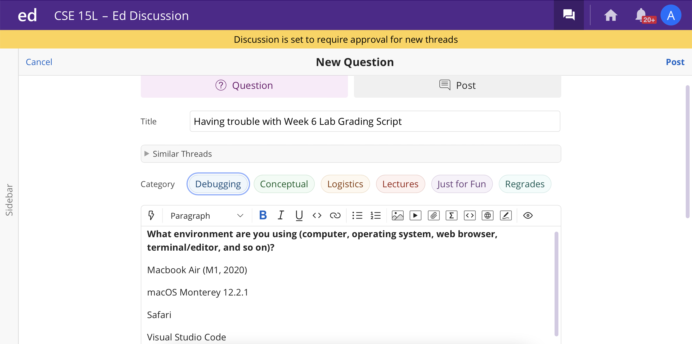
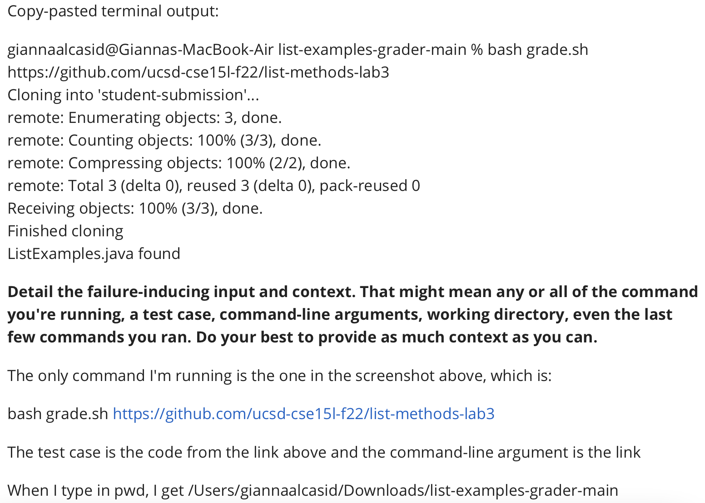
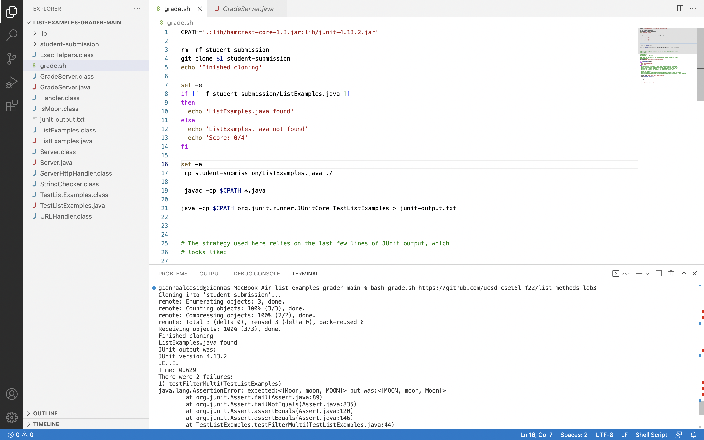
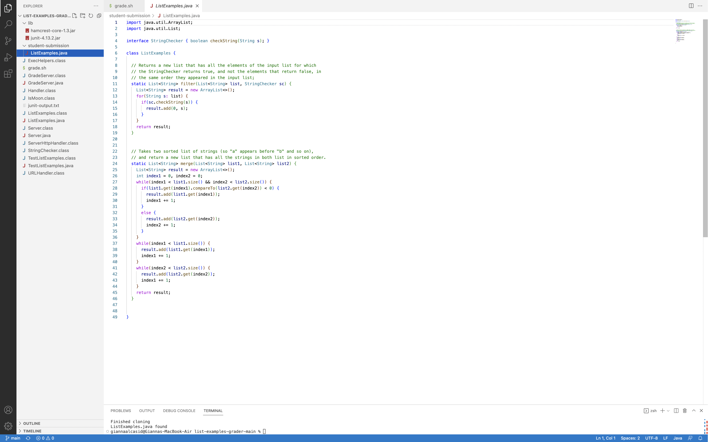
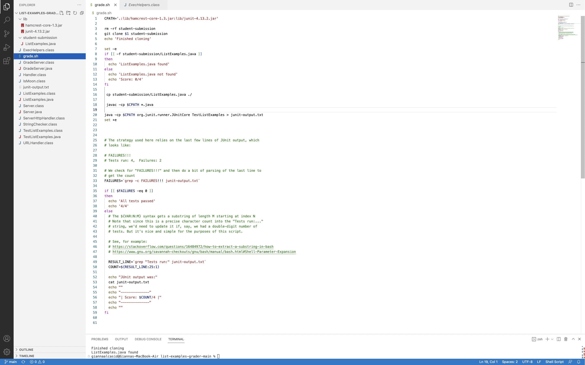
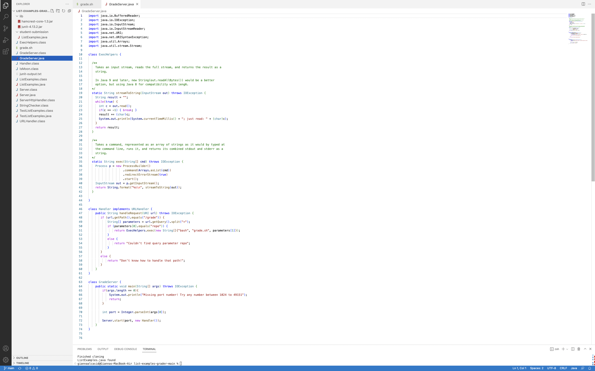
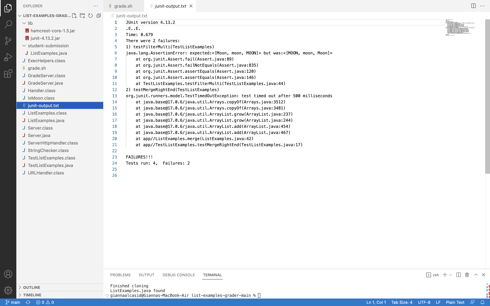
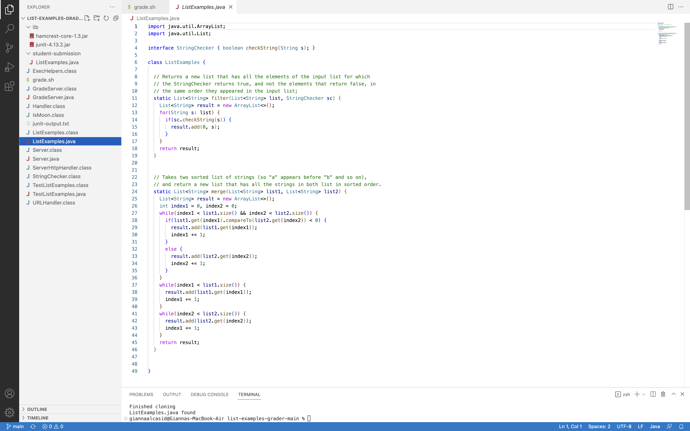
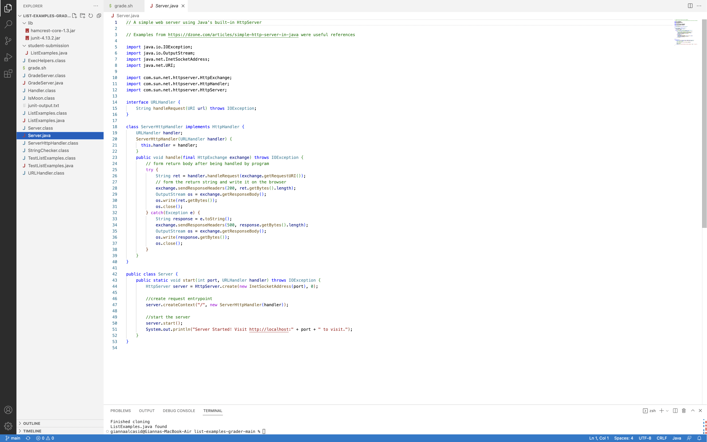
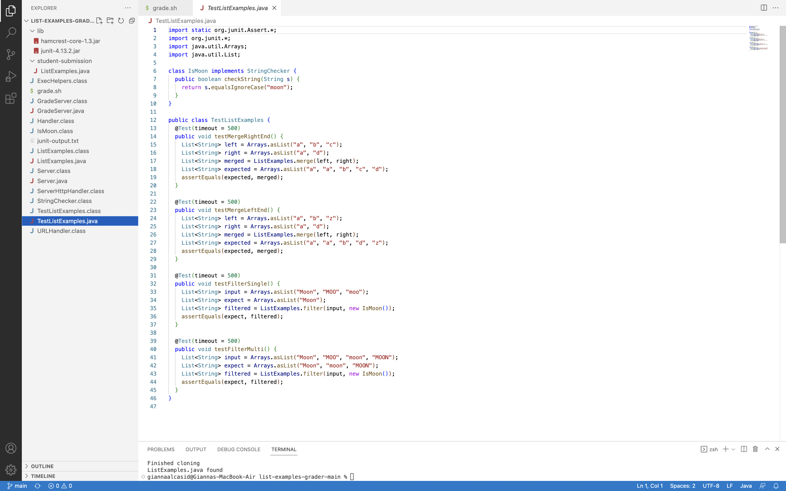

# Lab Report 5
## Part 1 - Debugging Scenario
### 1. The original post from a student with a screenshot showing a symptom and a description of a guess at the bug/some sense of what the failure-inducing input is. (Don’t actually make the post; just write the content that would go in such a post)
### 
### 
### 
Note: This is not code that I've written. I only added a bug for the purpose of this lab. In the write-up, it says, "Feel free to set this up by cloning and breaking some existing code like the grading script or code from class" so I am using the code from Week 9 Lab Scenario 2 (with the initial bug fixed).
### 2. A response from a TA asking a leading question or suggesting a command to try (To be clear, you are mimicking a TA here.)
"Good question. You said that your code 'seems to finish after line 10'. Think about a command you wrote in grade.sh that tells bash to exit when an error is encountered. Without turning this off, your code will immediately exit when it reaches a nonzero status. Since the error seems to be happening after cloning, what does that say about the location of the error? That might be where you want to turn something off. Refer to part 4 of the Your Grading Script Lab Task. Try to follow the suggestion it provides and see if that makes any difference."
### 3. Another screenshot/terminal output showing what information the student got from trying that, and a clear description of what the bug is.
### 
The screenshot above shows the changes the student made from listening and trying out the suggestion made by the TA, and the output that followed. The bug here isn't an error message like usual. Instead, the student was expecting to see two failures in the output, but because they added in ```set -e```, their code would exit before it ever got to doing that. The student attempted to turn this off in line 21 (before the bug was fixed), but it was in the wrong location, therefore bash would still exit even when it wasn't supposed to.
### 4. At the end, all the information needed about the setup including:
#### * The file & directory structure needed
#### * The contents of each file before fixing the bug
#### 
#### 
#### 
#### 
#### 
#### 
#### 
#### * The full command line (or lines) you ran to trigger the bug
```bash grade.sh https://github.com/ucsd-cse15l-f22/list-methods-lab3```
#### * A description of what to edit to fix the bug
Turn off ```set -e``` by taking what was originally in line 21 (```set +e```) and move it to before the line that has ```cp student-submission/ListExamples.java ./```.
