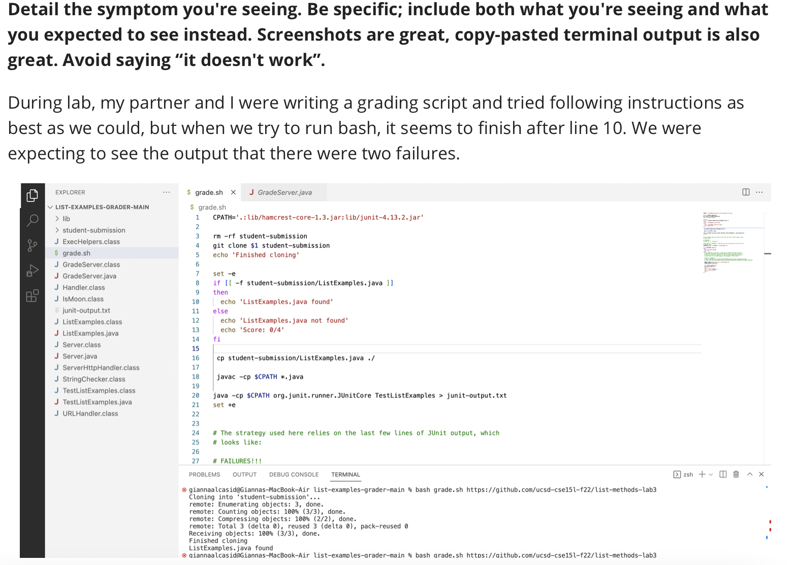

# Lab Report 5
## Part 1 - Debugging Scenario
### 1. The original post from a student with a screenshot showing a symptom and a description of a guess at the bug/some sense of what the failure-inducing input is. (Don’t actually make the post; just write the content that would go in such a post)
### 
### 
### 
### 2. A response from a TA asking a leading question or suggesting a command to try (To be clear, you are mimicking a TA here.)
